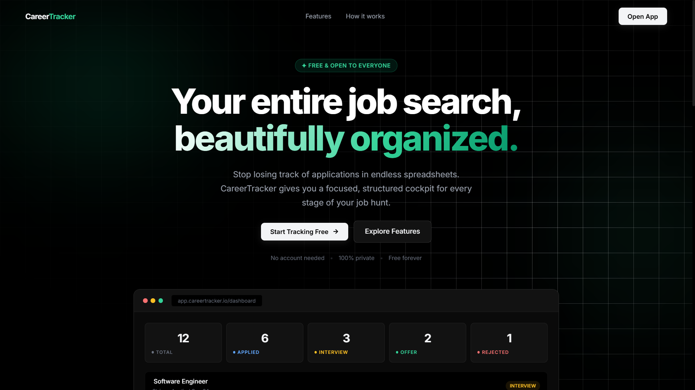
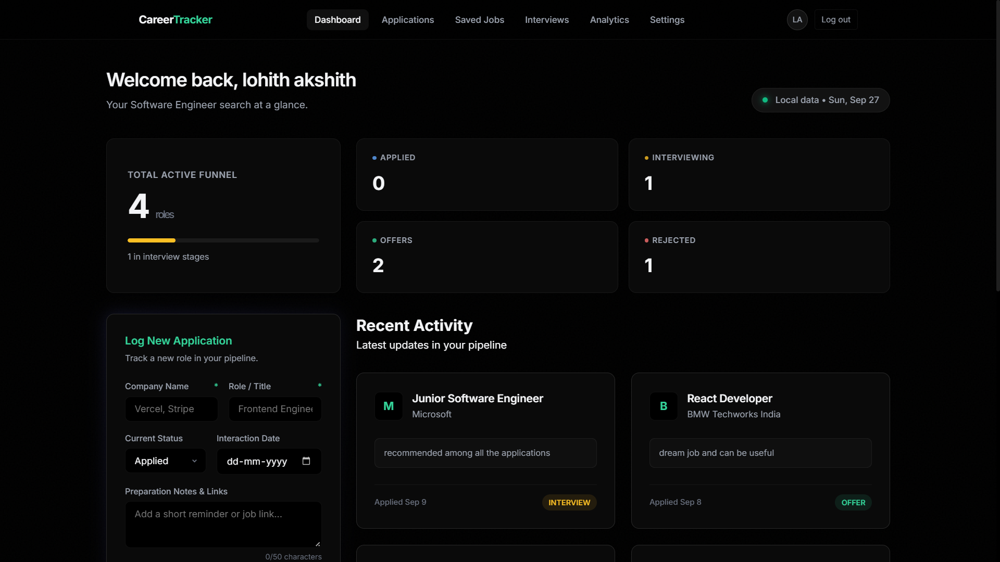
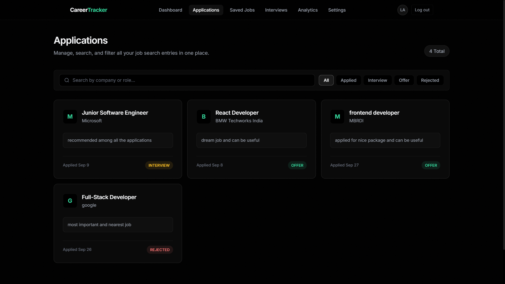
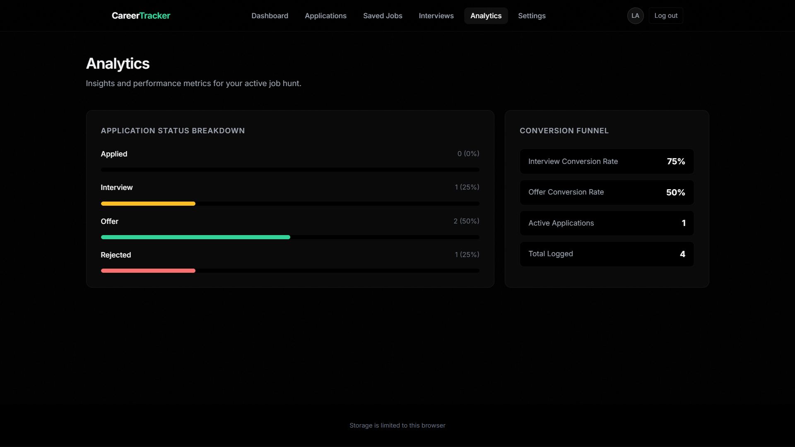

# CareerTracker

A React-based job application tracker for organizing applications, saved jobs, interviews, job-search progress, and career activity in one place.

CareerTracker provides a dashboard-driven interface with persistent browser storage, analytics, application management, interview tracking, and profile preferences.

## Demo

### Live Demo: https://careertracker-ndul.onrender.com/

## Screenshots









## Features

- **Application Tracking**
  - Add, edit, and delete job applications
  - Track company, role, status, date, and notes
  - Organize applications by status

- **Saved Jobs**
  - Save job opportunities for later
  - Store company, role, location, salary, tags, and posting age
  - Convert saved opportunities into tracked applications

- **Interview Management**
  - Add and manage interviews
  - Track interview date, time, type, interviewer, location, status, and notes
  - View upcoming interviews from the dashboard

- **Dashboard**
  - Overview of applications, saved jobs, and interviews
  - Quick access to common job-search actions
  - Derived statistics from stored records

- **Analytics**
  - Analyze application activity and job-search progress
  - Visualize application data and status distribution

- **Profile & Settings**
  - Manage profile information
  - Configure application preferences
  - Toggle interface preferences

- **Persistent Browser Storage**
  - Saves application data using `localStorage`
  - Automatically restores saved data when the application starts
  - Handles browser storage errors and size limits

## Tech Stack

- React
- Vite
- JavaScript
- CSS
- Browser `localStorage`
- Render

## Project Structure

```text
CareerTracker/
├── public/
│
├── src/
│   ├── components/
│   │   ├── AppNav.jsx
│   │   ├── ApplicationForm.jsx
│   │   ├── ApplicationCard.jsx
│   │   ├── ApplicationList.jsx
│   │   ├── LandingPage.jsx
│   │   └── ...
│   │
│   ├── pages/
│   │   ├── DashboardPage.jsx
│   │   ├── ApplicationsPage.jsx
│   │   ├── SavedJobsPage.jsx
│   │   ├── InterviewsPage.jsx
│   │   ├── AnalyticsPage.jsx
│   │   └── SettingsPage.jsx
│   │
│   ├── hooks/
│   │   └── useAppData.js
│   │
│   ├── data/
│   │   └── appData.js
│   │
│   ├── App.jsx
│   ├── App.css
│   ├── pages.css
│   ├── index.css
│   └── main.jsx
│
├── index.html
├── package.json
├── package-lock.json
├── vite.config.js
├── render.yaml
└── .node-version
```

### Architecture

The application follows a component-based React architecture.

```text
Browser
   │
   ▼
React Application
   │
   ├── Landing Page
   │
   └── Application
        │
        ├── Dashboard
        ├── Applications
        ├── Saved Jobs
        ├── Interviews
        ├── Analytics
        └── Settings
             │
             ▼
        useAppData Hook
             │
             ▼
        localStorage
```

Application state is managed through React state and the `useAppData` hook. Changes are serialized and persisted to browser storage. Dashboard and analytics data are derived from the same application records.

## Data Storage

CareerTracker stores application data in the browser's `localStorage` under:

```text
job-application-tracker:data:v1
```

The stored data includes:

- Applications
- Saved jobs
- Interviews
- Profile information
- Application preferences

New installations start with empty application, saved-job, and interview records.

The application restores saved data when it starts and persists changes when records or settings are updated.

## Storage Limitations

CareerTracker uses device-local browser storage rather than a backend database.

- Data does not synchronize between devices or browsers.
- Clearing site data removes the stored records from that browser.
- The application handles storage write errors.
- Notes are limited to 50 characters.
- Attachments, images, and full job descriptions should not be stored in `localStorage`.
- The application keeps saved data below an estimated 4 MiB to leave room under the commonly available browser storage limit.

Do not store passwords, access tokens, or other sensitive secrets in browser storage.

## Getting Started

### Prerequisites

- Node.js
- npm

### Installation

Clone the repository and install the dependencies:

```bash
npm install
```

### Start the development server

```bash
npm run dev
```

Vite will provide a local development URL in the terminal.

## Production Build

Create an optimized production build with:

```bash
npm run build
```

The generated files are placed in:

```text
dist/
```

To preview the production build locally:

```bash
npm run preview
```

## Deployment

CareerTracker is configured as a static Vite application for deployment on Render.

The repository includes a `render.yaml` configuration that:

- Installs dependencies using `npm ci`
- Builds the application using `npm run build`
- Publishes the generated `dist` directory

The `.node-version` file is used to pin the Node.js version for the deployment environment.

## Notes

CareerTracker is a frontend-focused project designed to practice React component architecture, state management, controlled forms, persistent browser storage, derived application data, and production deployment.
